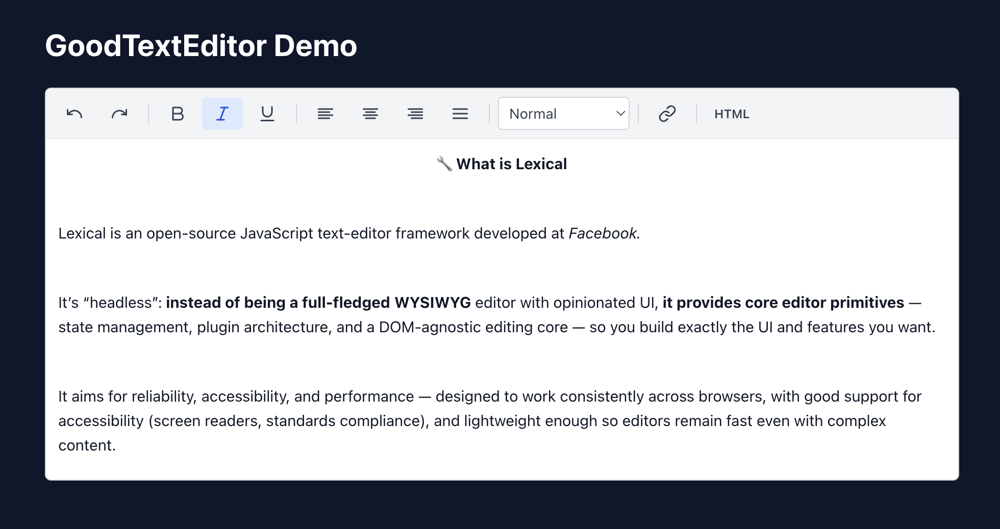

# GoodTextEditor – is a low-key, copy-paste Lexical editor for React -  
# Statrt with thank you https://github.com/facebook/lexical

GoodTextEditor is a small, self-contained **Lexical-based rich text editor** you can copy straight into your React codebase.  
It focuses on being **easy to drop in, easy to customise**, and not pretending to be a full npm package.



---

## Why consider this editor?

- **Drop-in folder** – no npm package, no bundling complexity; just copy the `text_editor` folder into your project.
- **Clean HTML output** – includes a small `cleanLexicalOutput` helper that removes Lexical’s `white-space: pre-wrap` noise and normalises the HTML.
- **Visual + HTML modes** – toggle between WYSIWYG editing and raw HTML editing via a simple toolbar button.
- **Zero UI dependencies** – all toolbar icons are inline SVG; only the Lexical packages are required.
- **Fully customisable** – edit toolbar buttons, styles, node configuration, output cleaning, and behaviour as needed.

---

## Copy-paste installation

### 1. Install the required packages

From your React project root:

```bash
# Required Lexical packages
npm install lexical   @lexical/react   @lexical/html   @lexical/rich-text   @lexical/list   @lexical/link   @lexical/history   @lexical/selection

# Optional: replace inline SVG icons with Lucide
npm install lucide-react
```

---

### 2. Copy the `text_editor` folder

Copy the folder from this repository into your React app:

```txt
your-app/
  src/
    utils/
      text_editor/
        GoodTextEditor.tsx
        Toolbar.tsx
        index.ts
        styles.css
```

---

### 3. Import and use the editor

In any React component:

```tsx
import React, { useState } from "react"
import { GoodTextEditor } from "./text_editor"

export function MyEditorPage() {
  const [html, setHtml] = useState("")

  return (
    <div style={{ maxWidth: 800, margin: "2rem auto" }}>
      <GoodTextEditor
        initialHtml={html}
        onChange={(value) => setHtml(value)}
      />

      {/* Preview HTML output */}
      <pre style={{ marginTop: 24, background: "#f3f4f6", padding: 12 }}>
        {html}
      </pre>
    </div>
  )
}
```

---

## Customisation

Because the entire editor lives under `text_editor/`, you can customise anything:

### Toolbar

- Add or remove buttons in `Toolbar.tsx`.
- Replace inline SVGs with `lucide-react` icons.
- Add new commands (e.g. code blocks, mentions, custom nodes).

### Output cleaning

- Modify `cleanLexicalOutput` inside `GoodTextEditor.tsx`.
- Add your own sanitisation or formatting rules.

### Styling

- Edit `styles.css` to match your design system.
- Change layout, colours, spacing, borders, or mode toggle UI.

### Lexical configuration

- Add more nodes to `editorConfig` (images, tables, custom nodes).
- Override the Lexical theme to style headings, lists, links, etc.

---

## Included demo (optional, via Docker)

This repo contains a small TanStack Start demo app under `demo/` that renders `GoodTextEditor` on the home page.

### Run the demo

```bash
docker compose build --no-cache
docker compose up
```

Then open:

```txt
http://localhost:3001
```

---

## Optional: How to recreate the demo app from scratch

If you want to rebuild the demo inside the Docker container with this brand new @tanstack/start project, run:

```bash
docker compose run --rm app sh -lc "npm create @tanstack/start@latest demo && cd demo && npm install"
docker compose up -d
```

Then install the Lexical dependencies inside the `demo` project:

```bash
docker compose run --rm app sh -lc "cd demo && npm install lexical @lexical/react @lexical/html @lexical/rich-text @lexical/list @lexical/link @lexical/history @lexical/selection"
```

Or manually inside the container:

```bash
cd demo
npm install lexical @lexical/react @lexical/html @lexical/rich-text @lexical/list @lexical/link @lexical/history @lexical/selection
```

---

## License

MIT — free to copy, modify, and embed into your own projects.
